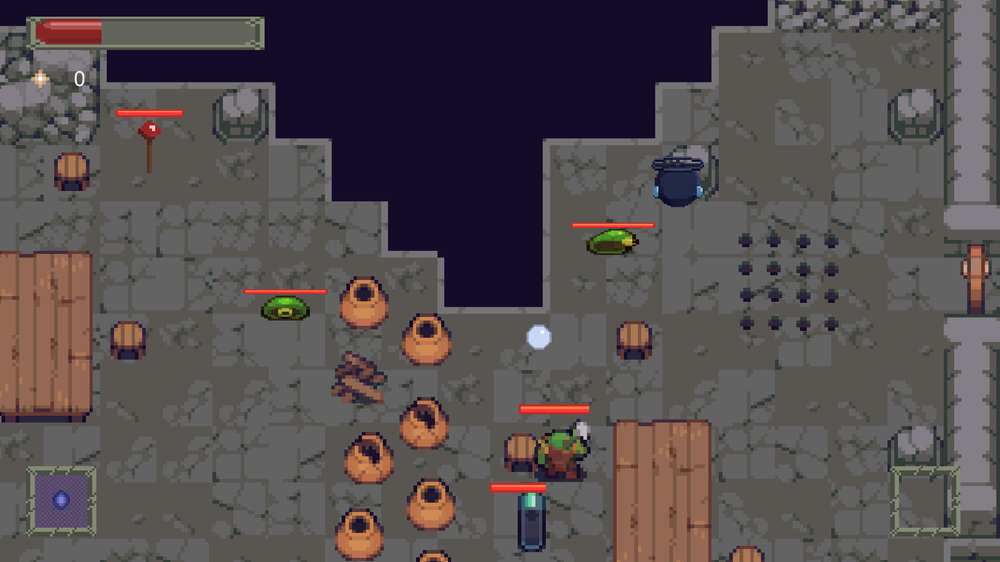
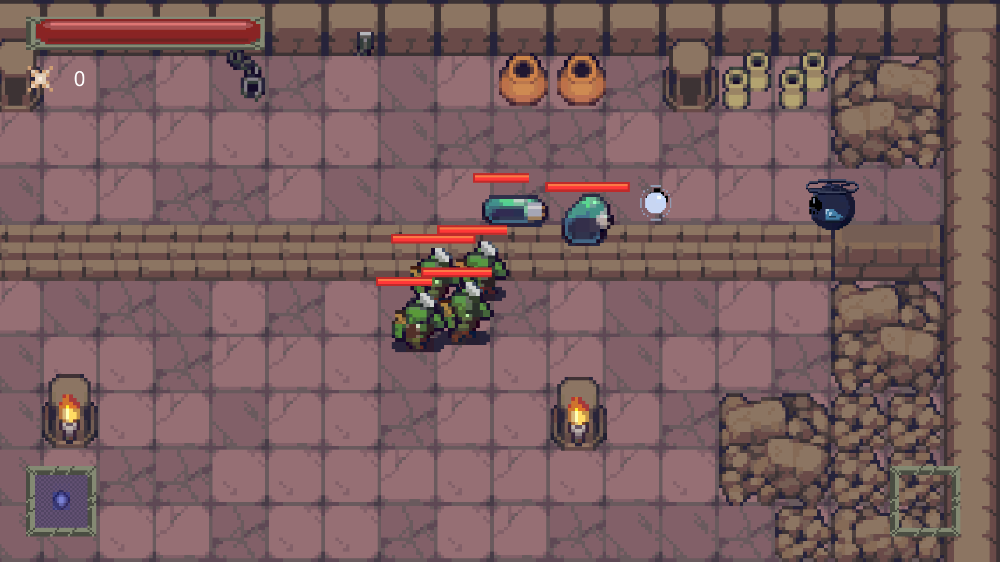

# ProjectBlitz

STATUS: Indefinido

EQUIPE: Luis Carneiro (Programação e Design)
        Victor Lopes (Arte e animação)
        Larissa Stork (Programação)
        André Gueiros (Design)

PLATAFORMA: PC

Jogo utilizado para defesa da graduação em Jogos Digitais na Fatec Carapicuiba, se trata de um rogueike que utiliza técnicas de IA e aprendizado de máquina para identificar o estilo de gameplay que o jogar esta assumindo na seção atual e modificar o comportamento de um NPC's auxiliar para complementar o estilo de jogo identificado.

